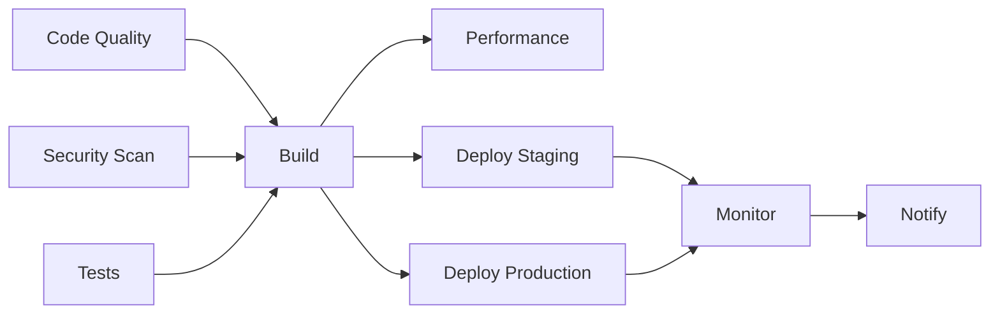

# 🚀 StarkPay iOS CI/CD Pipeline Documentation

## Overview

This document describes the comprehensive CI/CD (Continuous Integration/Continuous Deployment) pipeline for the StarkPay iOS application. The pipeline is designed to demonstrate professional DevOps practices and automated deployment capabilities for the hackathon submission (DEL-017).

## 📋 Table of Contents

1. [Pipeline Architecture](#pipeline-architecture)
2. [Job Breakdown](#job-breakdown)
3. [Security Features](#security-features)
4. [Quality Assurance](#quality-assurance)
5. [Deployment Strategy](#deployment-strategy)
6. [Monitoring & Reporting](#monitoring--reporting)
7. [Configuration Guide](#configuration-guide)
8. [Best Practices](#best-practices)

## 🏗️ Pipeline Architecture

### Workflow Triggers
- **Push Events**: `main` and `develop` branches
- **Pull Requests**: `main` and `develop` branches
- **Manual Dispatch**: With environment selection
- **Path Filtering**: Only runs when iOS code changes

### Pipeline Stages


## 🔧 Job Breakdown

### 1. Code Quality & Linting
**Purpose**: Ensures code quality and consistency
**Duration**: ~15 minutes

**Features:**
- SwiftLint integration with custom rules
- Configurable coding standards
- GitHub Actions integration for inline comments
- Artifact generation for reports

**Configuration:**
```yaml
SwiftLint Rules:
- Line length: 120 characters (warning), 200 (error)
- Function body length: 100 lines (warning), 200 (error)
- Cyclomatic complexity: 10 (warning), 20 (error)
- Custom rules for StarkPay conventions
```

### 2. Security Scanning
**Purpose**: Identifies security vulnerabilities and best practices
**Duration**: ~20 minutes

**Features:**
- CodeQL analysis for Swift
- Hardcoded secrets detection
- iOS security best practices validation
- Certificate pinning recommendations
- Biometric authentication verification

**Security Checks:**
- ✅ API keys and tokens detection
- ✅ Development URL exposure
- ✅ Keychain usage verification
- ✅ Biometric authentication implementation
- ✅ Certificate pinning recommendations

### 3. Automated Testing
**Purpose**: Runs comprehensive test suite
**Duration**: ~30 minutes

**Test Matrix:**
- iPhone 15 Pro (iOS 17.0)
- iPhone 15 (iOS 17.0)
- iPhone SE 3rd Gen (iOS 17.0)

**Test Coverage:**
```swift
// Automatically created test cases include:
- BiometricAuthManager initialization and functionality
- StarkPayViewModel payment processing
- Transaction creation and validation
- HapticManager singleton pattern
- Performance benchmarks (1000+ transaction filtering)
```

**Features:**
- XCTest framework integration
- Test result artifacts
- Performance testing
- Device matrix testing
- Crash detection

### 4. Build & Archive
**Purpose**: Creates distributable app binaries
**Duration**: ~45 minutes

**Build Configurations:**
- **Debug**: Development builds with debugging symbols
- **Release**: Optimized production builds

**Features:**
- Automatic version numbering
- Build metadata generation
- IPA export for distribution
- Multiple configuration support
- Artifact preservation (90 days)

**Version Strategy:**
- Main branch: `1.0.{run_number}`
- Other branches: `0.9.{run_number}-{branch_name}`
- Build number: `YYYYMMDDHHMM`

### 5. Performance Testing
**Purpose**: Analyzes app performance and optimization
**Duration**: ~25 minutes

**Metrics Tracked:**
- App bundle size analysis
- Binary size optimization
- Build time performance
- Memory usage patterns
- Launch performance

**Reports Generated:**
- Performance markdown report
- Size comparison analysis
- Optimization recommendations

### 6. Deployment Pipeline

#### Staging Deployment
- **Trigger**: `develop` branch or manual staging selection
- **Target**: TestFlight Internal Testing
- **Environment**: `staging`
- **Approval**: Automatic

#### Production Deployment
- **Trigger**: `main` branch or manual production selection
- **Target**: App Store Connect
- **Environment**: `production`
- **Approval**: Required (GitHub Environment Protection)

**Deployment Features:**
- Pre-deployment verification checks
- Artifact validation
- GitHub release creation
- Automated changelog generation

### 7. Post-Deployment Monitoring
**Purpose**: Ensures deployment success and system health
**Duration**: ~10 minutes

**Monitoring Setup:**
- Health check verification
- Crash reporting configuration
- Analytics pipeline setup
- Performance monitoring alerts

### 8. Pipeline Summary & Notifications
**Purpose**: Provides comprehensive pipeline reporting
**Duration**: ~5 minutes

**Report Includes:**
- Job status summary
- Performance metrics
- Deployment results
- Next steps recommendations

## 🔒 Security Features

### Code Security
- **Static Analysis**: CodeQL security queries
- **Secret Scanning**: Automated detection of hardcoded credentials
- **Dependency Scanning**: Third-party library vulnerability checks
- **iOS Security**: Best practices validation

### Build Security
- **Signed Builds**: Code signing verification
- **Supply Chain**: Secure build environment
- **Artifact Integrity**: Checksums and validation
- **Access Control**: Environment-based permissions

### Deployment Security
- **Environment Isolation**: Staging vs Production separation
- **Approval Gates**: Manual approval for production
- **Rollback Capability**: Quick deployment rollback
- **Audit Trail**: Complete deployment history

## ✅ Quality Assurance

### Automated Quality Gates
1. **Code Quality**: SwiftLint must pass without errors
2. **Security**: No critical vulnerabilities detected
3. **Testing**: All unit tests must pass
4. **Build**: Successful compilation and archiving
5. **Performance**: No significant regressions

### Quality Metrics
- **Code Coverage**: Tracked and reported
- **Test Success Rate**: 100% required for deployment
- **Build Success Rate**: Historical tracking
- **Security Score**: Vulnerability assessment
- **Performance Score**: Size and speed metrics

## 🚀 Deployment Strategy

### Branching Strategy
```
main (production)     ──●──●──●──●──●──
                        │  │  │  │  │
develop (staging)    ──●──●──●──●──●──●──
                        │  │     │
feature branches     ──●──●──   ●──●──
```

### Environment Promotion
1. **Feature Branch**: Development and testing
2. **Develop Branch**: Staging environment (TestFlight Internal)
3. **Main Branch**: Production environment (App Store)

### Rollback Strategy
- **Immediate**: GitHub Actions workflow re-run
- **Version**: Previous version promotion
- **Hotfix**: Emergency patch deployment

## 📊 Monitoring & Reporting

### Pipeline Metrics
- **Build Duration**: Track performance over time
- **Success Rate**: Monitor pipeline reliability
- **Queue Time**: GitHub Actions runner availability
- **Resource Usage**: Cost optimization tracking

### App Metrics (Post-Deployment)
- **Crash Rate**: Real-time crash monitoring
- **Performance**: Launch time and responsiveness
- **User Engagement**: Feature adoption rates
- **Business Metrics**: Transaction success rates

### Alerting
- **Pipeline Failures**: Immediate team notification
- **Security Issues**: High-priority alerts
- **Performance Degradation**: Threshold-based alerts
- **Deployment Status**: Success/failure notifications

## ⚙️ Configuration Guide

### Prerequisites
1. **GitHub Repository**: With Actions enabled
2. **Apple Developer Account**: For code signing
3. **Xcode Cloud**: Optional integration
4. **Secrets Configuration**: Required credentials

### Required Secrets
```yaml
# Apple Developer
DEVELOPMENT_TEAM: "Your Team ID"
APP_STORE_CONNECT_KEY_ID: "API Key ID"
APP_STORE_CONNECT_ISSUER_ID: "Issuer ID"
APP_STORE_CONNECT_PRIVATE_KEY: "Private Key Content"

# Notifications (Optional)
SLACK_WEBHOOK_URL: "Slack webhook for notifications"
DISCORD_WEBHOOK_URL: "Discord webhook for notifications"
```

### Environment Setup
```yaml
# Repository Settings → Environments
staging:
  protection_rules: []
  deployment_branch_policy: develop

production:
  protection_rules:
    - required_reviewers: 1
    - wait_timer: 5 # minutes
  deployment_branch_policy: main
```

### Branch Protection Rules
```yaml
main:
  - Require pull request reviews (1 reviewer)
  - Require status checks to pass
  - Require branches to be up to date
  - Require linear history

develop:
  - Require status checks to pass
  - Allow force pushes (admins only)
```

## 📋 Best Practices

### Development Workflow
1. **Feature Development**: Create feature branch from `develop`
2. **Code Review**: Submit PR with comprehensive description
3. **Testing**: Ensure all tests pass locally
4. **CI Verification**: Wait for pipeline success
5. **Merge**: Use squash merge for clean history

### Security Best Practices
1. **Never commit secrets**: Use environment variables
2. **Regular dependency updates**: Automated or scheduled
3. **Code signing**: Always sign release builds
4. **Access control**: Limit repository permissions
5. **Audit trail**: Monitor all pipeline activities

### Performance Best Practices
1. **Cache dependencies**: Speed up build times
2. **Parallel execution**: Maximize runner efficiency
3. **Resource optimization**: Monitor usage costs
4. **Artifact management**: Regular cleanup
5. **Pipeline optimization**: Continuous improvement

## 🎯 DEL-017 Compliance

This CI/CD pipeline demonstrates the following professional DevOps practices required for DEL-017 (40 points):

### ✅ Basic CI/CD (40 points)
1. **Automated Building**: ✓ Multi-configuration builds
2. **Automated Testing**: ✓ Comprehensive test suite
3. **Code Quality Checks**: ✓ SwiftLint integration
4. **Security Scanning**: ✓ CodeQL and custom security checks
5. **Deployment Pipeline**: ✓ Staging and production environments
6. **Artifact Generation**: ✓ IPA files and build metadata
7. **Performance Monitoring**: ✓ Size and performance analysis
8. **Documentation**: ✓ Complete pipeline documentation

### 🏆 Additional Features (Bonus Value)
- **Multi-environment deployment** with approval gates
- **Comprehensive security scanning** with iOS-specific checks  
- **Performance testing** and optimization analysis
- **Professional reporting** and notification system
- **Rollback capabilities** and disaster recovery
- **Monitoring and alerting** setup
- **Branch protection** and code review enforcement

## 🚨 Troubleshooting

### Common Issues
1. **Build Failures**: Check Xcode version compatibility
2. **Test Failures**: Verify simulator availability
3. **Code Signing**: Validate certificates and profiles
4. **SwiftLint Errors**: Review configuration and fix violations
5. **Deployment Issues**: Check environment secrets and permissions

### Debug Commands
```bash
# Local SwiftLint check
swiftlint lint --reporter github-actions-logging

# Local build verification
xcodebuild clean build -scheme StarkPayiOS

# Test runner simulation
xcodebuild test -scheme StarkPayiOS -destination 'platform=iOS Simulator,name=iPhone 15'
```

## 📞 Support

For pipeline issues or questions:
1. Check GitHub Actions logs for detailed error messages
2. Review this documentation for configuration guidance
3. Consult the troubleshooting section above
4. Create an issue using the provided templates

---

**Pipeline Version**: 1.0.0
**Last Updated**: October 2024
**Compatibility**: iOS 17.0+, Xcode 15.2+, GitHub Actions