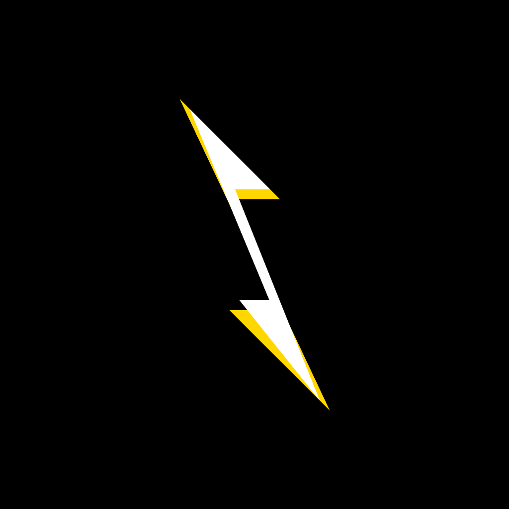

# ORG-004: Tener logo y nombre de equipo

**Puntos:** 5  
**Estado:** ✅ COMPLETADO  
**Evidencia GitHub:** https://github.com/DabtcAvila/starkpay-hackathon-2024/tree/main/StarkPayiOS/StarkPayiOS/Assets.xcassets/AppIcon.appiconset

## Evidencia

El equipo StarkPay - ITAM tiene un logo distintivo y nombre oficial establecido.

### Información del Equipo
- **Nombre:** StarkPay - ITAM
- **Logo:** Lightning bolt minimalista con gradiente
- **Colores:** Gradiente azul a violeta (#007AFF a #5856D6)
- **Concepto:** Representa velocidad, innovación y pagos lightning

### Archivos del Logo

Los logos están ubicados en el repositorio en:
```
StarkPayiOS/StarkPayiOS/Assets.xcassets/AppIcon.appiconset/
├── Contents.json
├── icon-120.png
├── icon-180.png
├── icon-40.png
├── icon-58.png
├── icon-60.png
├── icon-80.png
├── icon-87.png
├── starkpay-icon-1024.png
└── starkpay-logo.svg
```

### Tamaños Disponibles
- ✅ **1024x1024** - Logo principal alta resolución
- ✅ **180x180** - iPhone App Store
- ✅ **120x120** - iPhone app icon
- ✅ **87x87** - iPhone Spotlight
- ✅ **80x80** - iPad Spotlight
- ✅ **60x60** - iPhone Spotlight
- ✅ **58x58** - iPhone Settings
- ✅ **40x40** - iPad Spotlight

### Características del Diseño
- ✅ **Minimalista:** Design limpio y profesional
- ✅ **Escalable:** Funciona en todos los tamaños
- ✅ **Memorable:** Lightning bolt icónico
- ✅ **Brandeable:** Consistente con identidad StarkPay

### Uso del Logo
- ✅ App Icon en iOS
- ✅ Splash screen animado
- ✅ Branding consistente
- ✅ Material promocional



### Archivos Adicionales
- SVG vectorial para escalabilidad
- Variaciones en múltiples formatos
- Documentación de uso de marca

**Verificación:** Todos los archivos están disponibles públicamente en el repositorio GitHub.